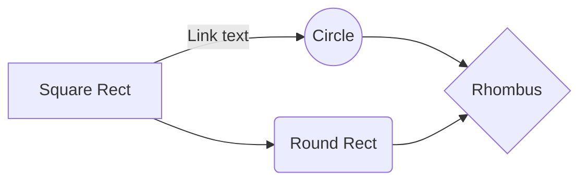

# A-npanRemote
ARKit parameter streaming kit for Unity.  
enable to receive ARKit parameter from iOS device to Unity Editor easily.  

## example usage

1. add https://github.com/statianzo/Fleck src folder into Assets/A-npanRemote/A-npanRemote/Editor.
1. build iOS project then install app into your iOS device.
1. play ARFaceTrackingSample/ARFaceTrackingSampleScene.unity scene in Unity Editor
1. play iOS app on device. then input PC's IP such as 192.168.1.11 into iOS app's input field and hit Connect button. 
so now you can receive Face tracking data on your Unity Editor.

## installation
unitypackage is not ready yet. copy A-npan remote folder manually.

1. copy Assets/A-npanRemote folder into your Project.
2. write your own remote receiving feature like the ARFaceTrackingSample. see __extend__.

## extend
A-npanRemote is easy to extend for other remote system. like VR.

step is below.

1. make your own sencing system. e,g, FaceTracking, VR head & hand position tracking.
2. extend your system by extends __RemoteBase__ class. this allow to call __OnData__ method.
3. call __OnData__ method where your system is receiving data from data source. [see example.](https://github.com/sassembla/A-npanRemote/blob/master/Assets/ARFaceTrackingSample/ARFaceTracking.cs#L37)

## license
MIT

